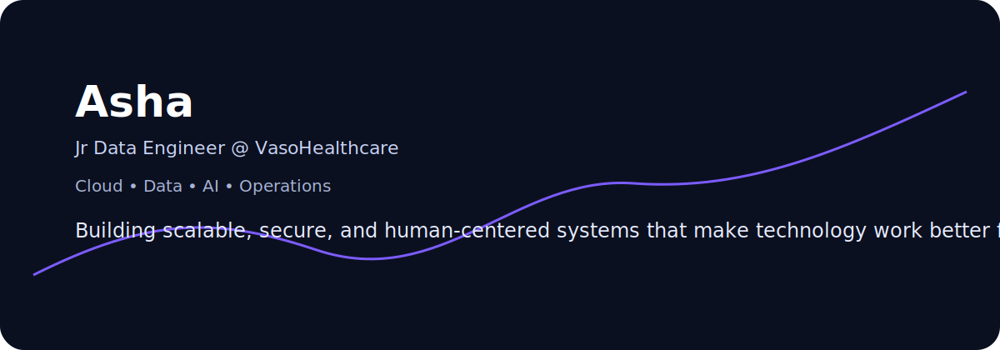

  

  

  

## About

I work at the intersection of cloud, data, and operations —  
designing systems that bring **clarity, structure, and scale** to complex environments.

What started as hands-on technical support has evolved into building and supporting systems that are not only functional — but sustainable.

---

## Focus

→ Cloud infrastructure and automation  
→ Data workflows and operational systems  
→ Monitoring and observability  
→ Service platforms and process improvement  
→ AI-informed enterprise thinking  

  

## Systems, Platforms & Infrastructure

**Cloud and Infrastructure**  
Microsoft Azure • Docker  

**Data and Platforms**  
NocoDB • Neon • Clover • structured workflows • integrations  

**Service and Knowledge Systems**  
Jira Service Management • Confluence • Loom • Atlassian ecosystem • Slack  

**Development and Automation**  
PowerShell • VS Code • JetBrains • Git • GitKraken • SnippetLab  

**Monitoring and Operations**  
Azure Monitor • Grafana • Prometheus • asset management • hardware troubleshooting  

**Design and Intelligent Workflows**  
Canva • Obsidian • Fireflies • AI tools • Microsoft 365 • Zoom • Beekeeper  

  

## Selected Work

• Cloud transformation (on-prem → Azure)  
• Enterprise service platform rollout  
• Internal technical training and enablement  
• Building scalable operational systems  

  

## Perspective

 <em>
    Long before anything was visible, the structure had already been decided.
  </em>

